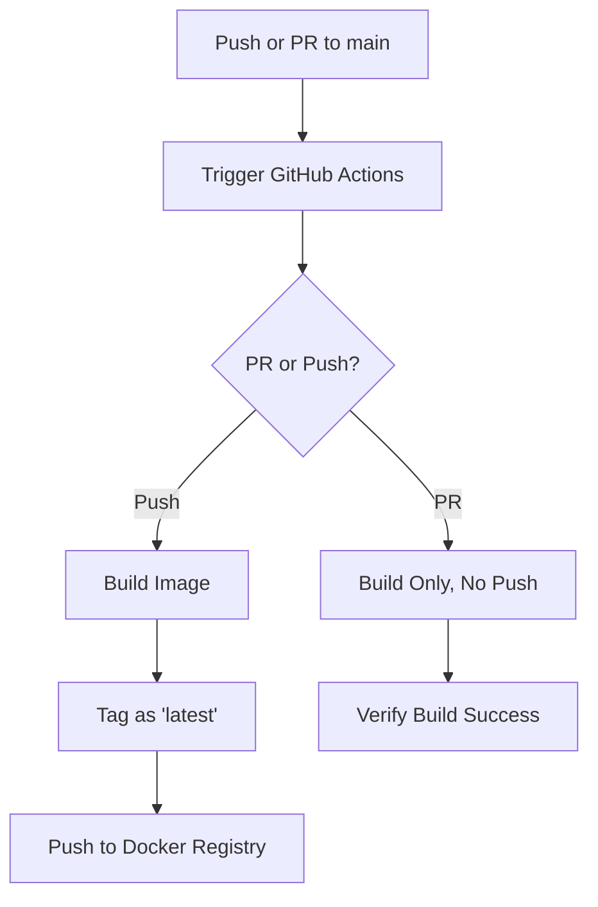

# NTU-cloud-native-HW4

---

## How to Build the Docker Image

1. Open a terminal and navigate to the project directory.
2. Run the following command to build the Docker image:

```bash
docker build -t hello-world-py .
```

## How to Run the Docker Container

Once the image is built, you can run it with:

```bash
docker build -t hello-world-py .
```

---
## CI/CD: Docker Image Automation via GitHub Actions
This project uses GitHub Actions to automatically build and push Docker images to a Docker registry (e.g., Docker Hub).



---
## Tagging Policy


---
## GitHub Actions Configuration

```yaml
name: Build and Push Docker Image

on:
  push:
    branches:
      - main
  pull_request:
    branches:
      - main

jobs:
  push-images:
    runs-on: ubuntu-latest

    steps:
      - name: Checkout code
        uses: actions/checkout@v4

      - name: Log in to Docker Registry
        run: echo "${{ secrets.DOCKER_PASSWORD }}" | docker login -u "${{ secrets.DOCKER_USERNAME }}" --password-stdin

      - name: Build Docker Image
        run: docker build -t 2025cloud/hello-world-js:latest .

      - name: Push Docker Image (only on push)
        if: github.event_name == 'push'
        run: docker push 2025cloud/hello-world-js:latest
```
